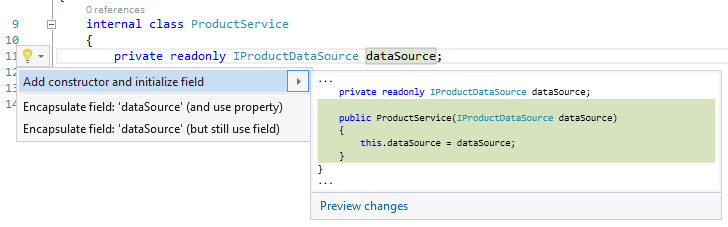
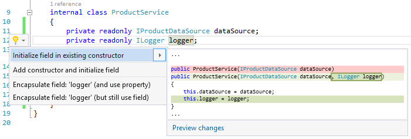

# Experimental Tools

<!-- Replace this badge with your own-->

<!-- Update the VS Gallery link after you upload the VSIX-->
Download this extension from the [VS Gallery](https://visualstudiogallery.msdn.microsoft.com/8ea7527b-98c9-4571-a43d-0b4851a010c3)
or get the [CI build](http://vsixgallery.com/extension/f2ba275d-a5ca-4bf9-b8ef-2e580cb13cd3/).

---------------------------------------

A bunch of quality refactorings and code fixes that are going to improve your C# development experience in Visual Studio and remove some common pain.

See the [change log](CHANGELOG.md) for changes and road map.

## Features

- Initialize field from constructor parameter
- Add constructor and initialize field
- Initialize field in existing constructor

### Initialize field from constructor parameter
Ctrl+. on a constructor parameter and choose *Add initialized field*.

### Add constructor and initialize field

Ctrl+. on a field and choose *Add constructor and initialize field*.

### Initialize field in existing constructor

Ctrl+. on a field and choose *Initialize field in existing constructor*.

## Contribute
Check out the [contribution guidelines](CONTRIBUTING.md)
if you want to contribute to this project.

For cloning and building this project yourself, make sure
to install the
[Extensibility Tools 2015](https://visualstudiogallery.msdn.microsoft.com/ab39a092-1343-46e2-b0f1-6a3f91155aa6)
extension for Visual Studio which enables some features
used by this project.

## License
[MIT](LICENSE)
