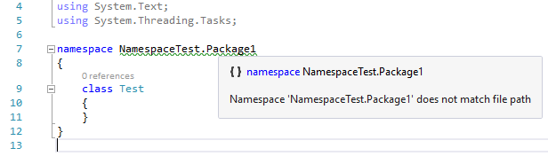
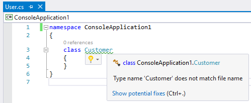
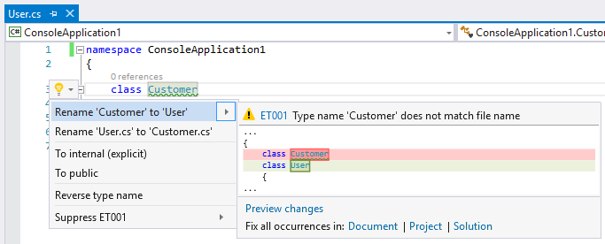
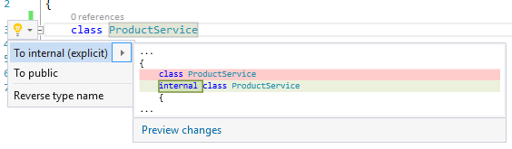
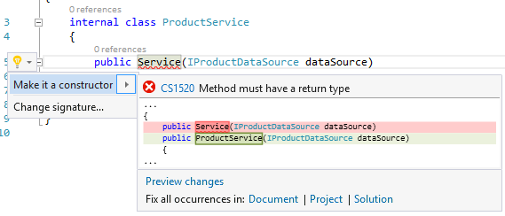
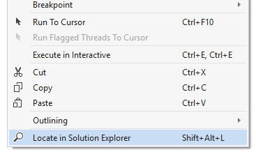
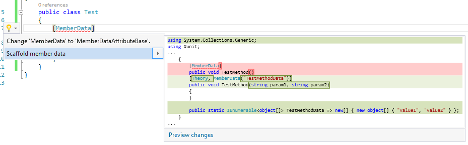
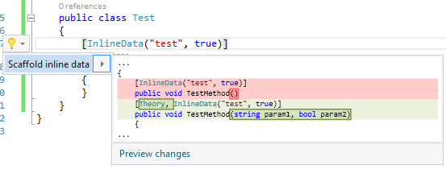
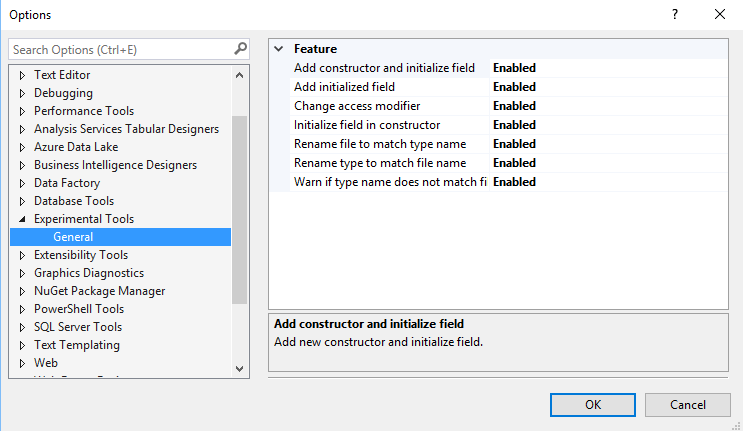

# Experimental Tools

<!-- Replace this badge with your own-->

<!-- Update the VS Gallery link after you upload the VSIX-->
Download this extension from the [VS Gallery](https://visualstudiogallery.msdn.microsoft.com/8ea7527b-98c9-4571-a43d-0b4851a010c3)
or get the [CI build](http://vsixgallery.com/extension/f2ba275d-a5ca-4bf9-b8ef-2e580cb13cd3/).

---------------------------------------

A bunch of quality refactorings and code fixes that are going to improve your C# development experience in Visual Studio and remove some common pain.

See the [change log](CHANGELOG.md) for changes and road map.

## Features

- Initialize field from constructor parameter
- Add constructor and initialize field
- Initialize field in existing constructor
- Namespace does not match file path analyzer
- Update file name to match type name (and vice versa)
- Change access modifier on type declarations
- Make it a constructor (when copied from another class)
- Locate in Solution Explorer (Shift+Alt+L)
- Scaffold xunit data driven tests
- Settings page (ability to enable/disable individual features)

### Initialize field from constructor parameter
Ctrl+. on a constructor parameter and choose *Add initialized field*.

### Add constructor and initialize field

Ctrl+. on a field and choose *Add constructor and initialize field*.

### Initialize field in existing constructor

Ctrl+. on a field and choose *Initialize field in existing constructor*.

### Namespace does not match file path analyzer

Analyze if a top level namespace does not match the path of the file where it is declared and display a warning.

It assumes assembly name as the root namespace as it's currently problematic to get the default namespace from within analyzers.

### Update file name to match type name (and vice versa)

Analyzes if a top level type name does not match the name of the file where it is declared and displays a warning.

It also offers to either rename the type to match the file name or rename the file to match the type name.

### Change access modifier on type declarations

Ctrl+. on a type declaration (either top level or nested) and choose one of proposed options.

### Make it a constructor (when copied from another class)

Sometimes you copy code from another class into a new one and this quick fix allows you to update the constructor name.

### Locate in Solution Explorer (Shift+Alt+L)

There is a standard command in Solution Explorer called 'Sync with Active Document'. People coming from ReSharper will appreciate its Shift+Alt+L equivalent.

The command is available in the code editor either from the context menu or as a shortcut.

### Scaffold xunit data driven tests

If you're a fan of Xunit data driven tests this one's going to be a little time saver for you. You can scaffold `MemberData`:

As well as `InlineData`:

If your `InlineData` contain acceptable parameters they will be respected unless the test method already defines parameters (in which case neither of the scaffolding refactoring will work).

Note that this feature works with Xunit 2.x only.

### Settings page (ability to enable/disable individual features)

All features can be individually enabled or disabled.

## Contribute
Check out the [contribution guidelines](CONTRIBUTING.md)
if you want to contribute to this project.

For cloning and building this project yourself, make sure
to install the
[Extensibility Tools 2015](https://visualstudiogallery.msdn.microsoft.com/ab39a092-1343-46e2-b0f1-6a3f91155aa6)
extension for Visual Studio which enables some features
used by this project.

## License
[MIT](LICENSE)
